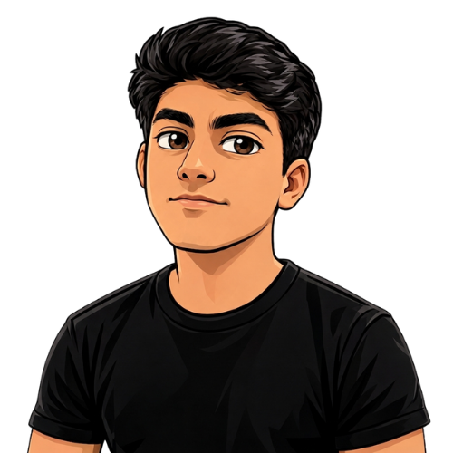

# Kaique Borlenghi

---

 

## Hello, devs 👋

Estudante de **Engenharia de Software**, transformando aprendizado, criatividade e tecnologia em projetos reais.

---

## Sobre mim

Sou estudante de **Engenharia de Software no Instituto Infnet** e tenho formação técnica em **Análise e Desenvolvimento de Sistemas pelo SENAI**.

Gosto de transformar ideias em soluções práticas por meio da tecnologia. Minha base de programação foi construída com **Python**, e atualmente venho aprofundando meus conhecimentos em **Java** e **C#**.

Também tenho experiência com conceitos de banco de dados, utilização de APIs e ferramentas que fazem parte da rotina de desenvolvimento. Além do código, exploro design, modelagem e impressão 3D, áreas que reforçam meu lado criativo e minha atenção aos detalhes.

Meu objetivo é evoluir como desenvolvedor, participar de projetos relevantes e conquistar uma oportunidade de estágio na área de tecnologia.

---

## Tecnologias e ferramentas

### Desenvolvimento

  

### Banco de dados e APIs

  

### Em desenvolvimento

  
  

---

## Áreas de interesse

| Área | Direção |
| :--- | :--- |
| Desenvolvimento de Software | Criação de aplicações e soluções úteis |
| Banco de Dados | Modelagem, consultas e organização de informações |
| APIs e Integrações | Comunicação entre sistemas e serviços |
| Segurança de Dados | Boas práticas e proteção da informação |
| Análise de Dados | Transformar dados em insights |
| Design e Modelagem 3D | Criatividade aplicada a projetos digitais e físicos |

---

## Diferenciais

- Comunicação clara para apresentar ideias e projetos técnicos;
- Perfil proativo, criativo e com facilidade para aprender;
- Interesse em unir tecnologia, design e resolução de problemas;
- Experiência em eventos e apresentações desenvolvidas no SENAI;
- Busca constante por evolução prática e profissional.

---

## Além da tecnologia

Fora do ambiente de desenvolvimento, gosto de explorar **edição de vídeo**, **modelagem e impressão 3D** e música, toco diversos **instrumentos**.

Acredito que criatividade e tecnologia funcionam melhor juntas: uma ajuda a imaginar possibilidades; a outra ajuda a colocá-las no mundo.

---

## Estatísticas do GitHub

  
  

---

> “Aprender, criar e evoluir: um projeto por vez.”

